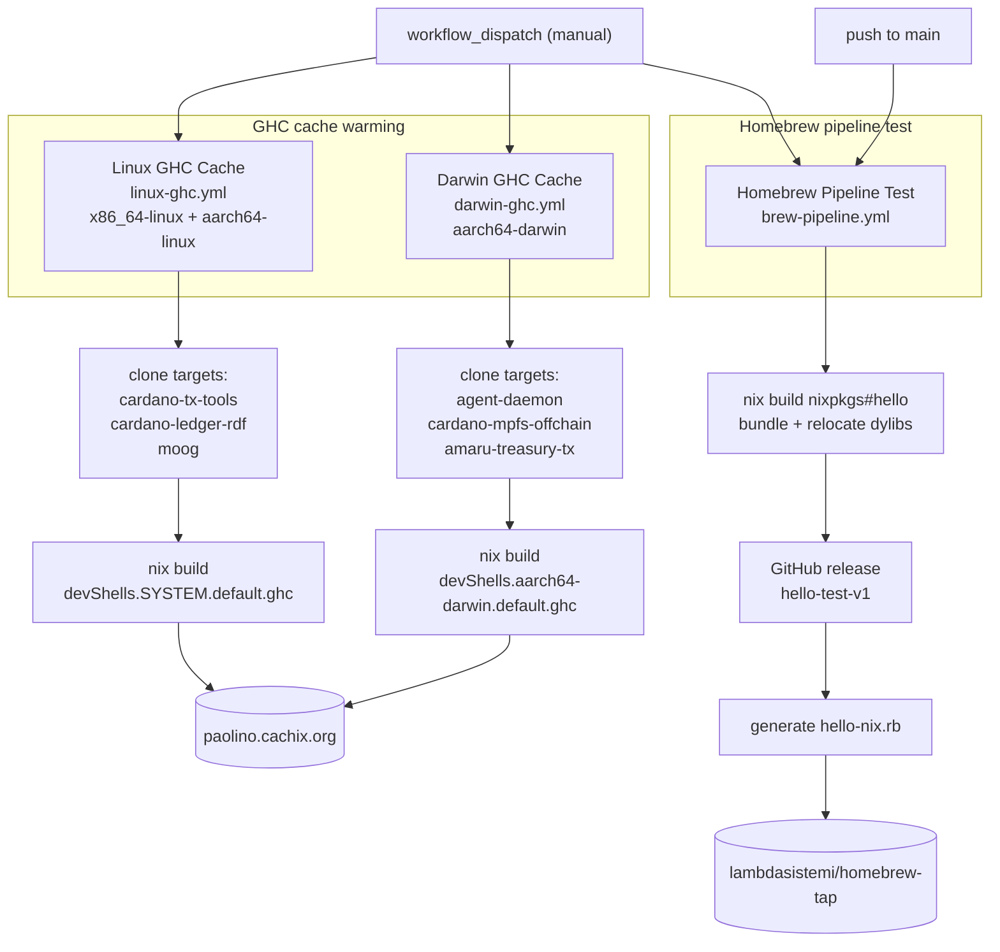

# cachix-warmup

Cachix cache-warming and Homebrew-distribution workflows for GHC across Linux and macOS.

## What is this

This repository holds nothing but GitHub Actions workflows. There is no source
code, no flake, and no installable artifact — the repository *is* the
automation.

Two of the workflows pre-build the GHC toolchain pulled in by several
Haskell/Nix projects and push the resulting store paths to the
[`paolino`](https://app.cachix.org/cache/paolino) Cachix cache, so that
developers and CI on those projects substitute a prebuilt GHC instead of
compiling it locally. One warms `x86_64-linux` and `aarch64-linux`; the other
warms `aarch64-darwin`.

The third workflow is a self-contained proof-of-concept for the Homebrew
distribution pipeline: it builds a sample Nix package, relocates its dynamic
libraries into a portable bundle, publishes a GitHub release, generates a
Homebrew formula, pushes it to [`lambdasistemi/homebrew-tap`](https://github.com/lambdasistemi/homebrew-tap),
and verifies `brew install` end to end.

All three workflows can be started manually; the Homebrew test also runs on
every push to `main`.

## Architecture



## Quickstart

Trigger a warm-up run from the command line (all three workflows accept
`workflow_dispatch`):

```bash
# Warm GHC for Linux (x86_64 + aarch64)
gh workflow run "Linux GHC Cache" --repo lambdasistemi/cachix-warmup

# Warm GHC for macOS (aarch64-darwin)
gh workflow run "Darwin GHC Cache" --repo lambdasistemi/cachix-warmup

# Exercise the Homebrew distribution pipeline
gh workflow run "Homebrew Pipeline Test" --repo lambdasistemi/cachix-warmup

# Watch the latest run
gh run watch --repo lambdasistemi/cachix-warmup
```

## Usage

### Workflows

| Workflow | File | Triggers | Runner(s) | What it does |
| --- | --- | --- | --- | --- |
| Linux GHC Cache | `.github/workflows/linux-ghc.yml` | `workflow_dispatch` | `ubuntu-latest`, `ubuntu-24.04-arm` | Builds `devShells.<system>.default.ghc` for the Linux target repos and pushes each store path to the `paolino` cache. Skips an attribute that a repo does not expose yet. |
| Darwin GHC Cache | `.github/workflows/darwin-ghc.yml` | `workflow_dispatch` | `macos-14` | Builds `devShells.aarch64-darwin.default.ghc` for the Darwin target repos and pushes each store path to the `paolino` cache. |
| Homebrew Pipeline Test | `.github/workflows/brew-pipeline.yml` | `push` to `main`, `workflow_dispatch` | `macos-14` | Bundles `nixpkgs#hello`, releases it as `hello-test-v1`, generates and pushes a Homebrew formula, then installs and runs it. |

Each warm-up step is `git clone --depth 1`, `nix build --no-link
--print-out-paths`, then `cachix push paolino`. The Linux job runs a matrix
over both architectures (`fail-fast: false`); the Darwin job is a single
`aarch64-darwin` runner.

### Warm-up targets

These are hard-coded in the workflow scripts. To change them, edit the
`repos`/`targets` arrays (see [Development](#development)).

- **Linux** (`devShells.<x86_64-linux|aarch64-linux>.default.ghc`, branch `main`):
  `lambdasistemi/cardano-tx-tools`, `lambdasistemi/cardano-ledger-rdf`,
  `cardano-foundation/moog`.
- **Darwin** (`devShells.aarch64-darwin.default.ghc`, branch `main`):
  `lambdasistemi/agent-daemon`, `lambdasistemi/cardano-mpfs-offchain`,
  `lambdasistemi/amaru-treasury-tx`.

### Consuming the warmed cache

Projects that want the prebuilt GHC add the `paolino` cache as a substituter
(the key below is the one the workflows configure):

```nix
extra-substituters = https://paolino.cachix.org
extra-trusted-public-keys = paolino.cachix.org-1:ecmgO3CXdgSWA2cHlm4srknd/cLFMLmK3i3NrzeDFaE=
```

### Required secrets

| Secret | Used by | Purpose |
| --- | --- | --- |
| `CACHIX_AUTH_TOKEN` | both GHC workflows | Authenticates `cachix push` to the `paolino` cache. |
| `TAP_TOKEN` | Homebrew pipeline | Push access to `lambdasistemi/homebrew-tap`. |
| `GITHUB_TOKEN` | Homebrew pipeline | Creates the `hello-test-v1` GitHub release (default token). |

## Documentation

For AI agents, start at [AGENTS.md](AGENTS.md). The
[`skills/cachix-warmup-guide`](skills/cachix-warmup-guide/SKILL.md) skill
describes the repository layout and how to add or change warm-up targets.

## Development

There is no build step. Changes are edits to the YAML under
`.github/workflows/`.

- **Add or remove a Linux target:** edit the `repos` array in
  `.github/workflows/linux-ghc.yml` (`"owner/repo branch"` per line). The job
  silently skips a repo that does not expose
  `devShells.<system>.default.ghc`, so a target only contributes once it
  declares that attribute for the matrix systems.
- **Add or remove a Darwin target:** edit the `targets` array in
  `.github/workflows/darwin-ghc.yml`
  (`"owner/repo branch flake-attr"` per line). This job does **not** skip a
  missing attribute — it fails if the attribute is absent.
- **Validate YAML before pushing:**

  ```bash
  gh workflow list --repo lambdasistemi/cachix-warmup
  ```

- **Run a workflow against a branch** (for `workflow_dispatch` workflows):

  ```bash
  gh workflow run "Linux GHC Cache" --repo lambdasistemi/cachix-warmup --ref <branch>
  ```
